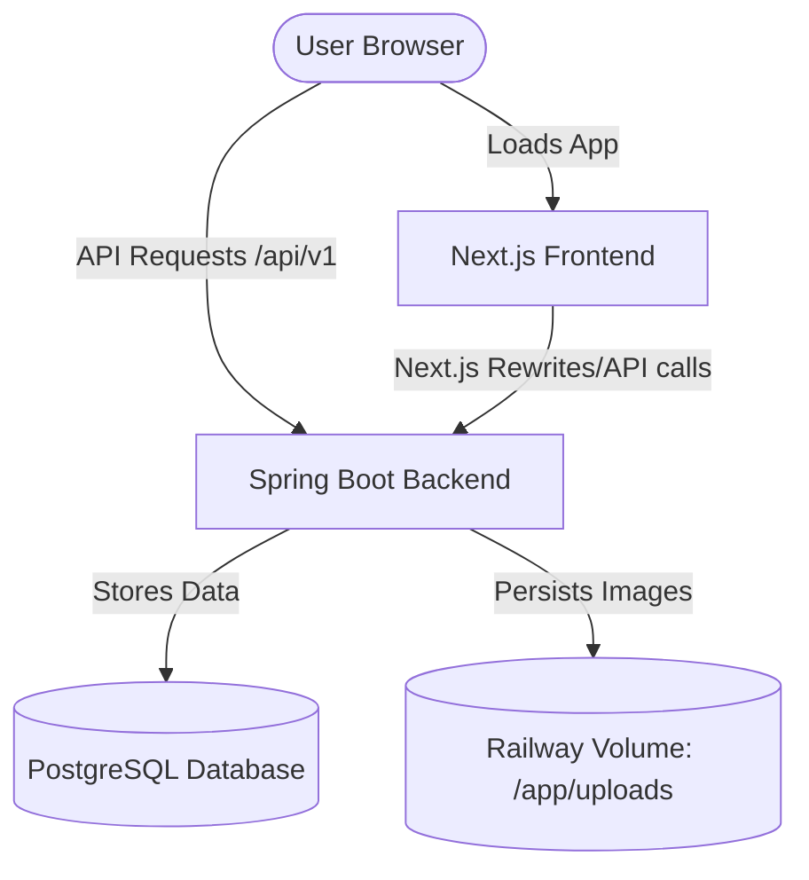

# Deploying MoonLight Stays to Railway

This guide walks you through deploying the **Spring Boot Backend** (`airBnbApp`) and **Next.js Frontend** (`moonlight-stays`) on Railway with a **PostgreSQL Database** and **Persistent Volume** storage.

---

## Architecture Overview



---

## Step 1: Provision a PostgreSQL Database on Railway

1. Go to your [Railway Dashboard](https://railway.app/).
2. Click **New Project** → **Provision PostgreSQL**.
3. Railway will spin up a PostgreSQL instance and automatically define database credentials under variables (`PGHOST`, `PGPORT`, `PGPASSWORD`, etc.).

---

## Step 2: Deploy the Spring Boot Backend

The backend is configured to build using the root `Dockerfile` and run as a production Spring Boot application.

1. In your Railway project, click **New** → **GitHub Repo** → select `AirBnb_BackEnd`.
2. Name the service `backend` (or similar).
3. Under **Settings** for the backend service:
   - **Root Directory**: Set to `/` (since the `Dockerfile` is at the repository root).
   - Railway will automatically detect the root `Dockerfile` and use it to build the project.
4. Go to **Variables** and add:

| Variable Name | Value | Purpose |
|---|---|---|
| `SPRING_PROFILES_ACTIVE` | `prod` | Enables the production database configurations |
| `JWT_SECRET_KEY` | *[Your Secret Key]* | Used to sign JWTs (Generate with: `openssl rand -base64 32`) |
| `FRONTEND_URL` | *[Your Frontend URL]* | Allows Stripe redirects to return to the frontend |
| `CORS_ALLOWED_ORIGINS` | *[Your Frontend URL]* | Allows Next.js to make AJAX calls to the backend |
| `STRIPE_SECRET_KEY` | `sk_live_...` or `sk_test_...` | Stripe payments integration (Optional) |
| `STRIPE_WEBHOOK_SECRET` | `whsec_...` | Stripe payment webhook validation (Optional) |
| `MAIL_USERNAME` | *[Your Email]* | SMTP mail sender address (Optional) |
| `MAIL_PASSWORD` | *[Your Email App Password]* | SMTP mail authentication token (Optional) |

5. **Link the PostgreSQL Database**:
   - In the **Variables** tab, click **New Variable** → **Reference Value** (`${{Postgres.DATABASE_URL}}`).
   - Clicking reference variables will link the database variables (like `PGHOST`, `PGUSER`, `PGPASSWORD`) to your backend. The application will automatically pick them up and connect.

### Configure Persistent Disk for File Uploads
Because Railway's file system is ephemeral, uploaded hotel images will be lost on deployments/restarts unless we attach a persistent volume:
1. Go to your backend service settings on Railway.
2. Scroll to the **Volumes** section.
3. Click **Add Volume**.
4. Set the **Mount Path** to `/app/uploads` and set size (e.g., 2 GB).
5. Deploy. All uploaded images will now persist!

---

## Step 3: Deploy the Next.js Frontend

The frontend is deployed as a standalone Node.js service using Nixpacks (Railway's default builder).

1. Click **New** → **GitHub Repo** → select `AirBnb_BackEnd`.
2. Name the service `frontend`.
3. Under **Settings** for the frontend service:
   - **Root Directory**: Set to `/moonlight-stays` (informs Railway to build in the Next.js directory).
4. Go to **Variables** and add:

| Variable Name | Value | Purpose |
|---|---|---|
| `NEXT_PUBLIC_API_URL` | `https://[your-backend-domain].up.railway.app/api/v1` | Tells the Next.js client where to find the Spring Boot backend API |

5. Go to settings and generate a public domain for the frontend (e.g. `your-frontend.up.railway.app`). Use this URL for your backend's `CORS_ALLOWED_ORIGINS` and `FRONTEND_URL` variables.

---

## Step 4: Verification Checklist

### 1. API Health Check
Once both services are deployed, check the backend health endpoint:
```bash
curl https://your-backend-domain.up.railway.app/api/v1/actuator/health
```
Expected response:
```json
{"status":"UP"}
```

### 2. Swagger Documentation
You can access your production Swagger UI at:
`https://your-backend-domain.up.railway.app/api/v1/swagger-ui/index.html`

### 3. Database Seeding
Upon first startup, if the database is empty, the app will auto-seed standard listing data so that searches work immediately. Check logs to verify seeding:
`Database empty. Starting sample data seeding...`
`Data seeding completed successfully.`
