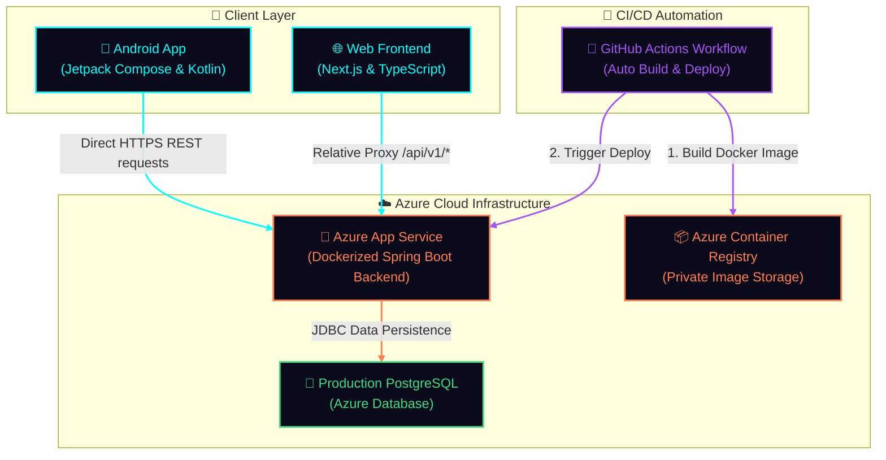

<div align="center">

# 🌙 Moonlight Stays

### Airbnb-style Hotel Booking Platform


[](https://spring.io/projects/spring-boot)
[](https://nextjs.org/)
[](https://www.typescriptlang.org/)
[](https://www.postgresql.org/)
[](https://azure.microsoft.com/)
[](https://stripe.com/)
[](https://developer.android.com/)

**Full-stack hotel booking application** with dynamic pricing, Stripe payments, role-based access, and production Azure deployment.

[API Docs](https://moonlight-stays-backend-d6hga6dtg6c3cya2.centralindia-01.azurewebsites.net/api/v1/swagger-ui.html) · [Report Bug](https://github.com/Snehil208001/MoonLight-Stays/issues) · [Request Feature](https://github.com/Snehil208001/MoonLight-Stays/issues)

</div>

---

## 📋 Table of Contents

- [About the Project](#-about-the-project)
- [Live Demo](#-live-demo)
- [Features](#-features)
- [Tech Stack](#-tech-stack)
- [Architecture](#-architecture)
- [Project Structure](#-project-structure)
- [Getting Started](#-getting-started)
- [Deployment](#-deployment)
- [API Overview](#-api-overview)
- [Documentation](#-documentation)
- [License](#-license)

---

## 🎯 About the Project

**Moonlight Stays** is a production-ready, full-stack hotel booking platform inspired by Airbnb. Built from scratch with modern technologies, it demonstrates end-to-end ownership from UI design to database schema, payment integration, and cloud deployment.

### Key Highlights

| Aspect | Implementation |
|--------|----------------|
| **Backend** | Java 17, Spring Boot 3.5, Spring Data JPA, Spring Security (JWT) |
| **Frontend** | Next.js 14 (App Router), React 18, TypeScript, Redux Toolkit, Tailwind CSS, Framer Motion |
| **Database** | PostgreSQL with complex relational models (hotels, rooms, bookings, reviews, promo codes) |
| **Payments** | Stripe Checkout with webhook verification |
| **Auth** | JWT with refresh tokens, role-based access (Guest / Hotel Manager) |
| **Design Patterns** | Strategy pattern for dynamic room pricing (surge, holiday, occupancy-based) |
| **DevOps** | Azure App Service (backend, Docker), Azure Container Registry, GitHub Actions CI/CD |

---

## 🚀 Live Demo

| Resource | URL |
|----------|-----|
| **Backend API** | [https://moonlight-stays-backend-d6hga6dtg6c3cya2.centralindia-01.azurewebsites.net/api/v1](https://moonlight-stays-backend-d6hga6dtg6c3cya2.centralindia-01.azurewebsites.net/api/v1) |
| **API Docs (Swagger)** | [https://moonlight-stays-backend-d6hga6dtg6c3cya2.centralindia-01.azurewebsites.net/api/v1/swagger-ui.html](https://moonlight-stays-backend-d6hga6dtg6c3cya2.centralindia-01.azurewebsites.net/api/v1/swagger-ui.html) |

---

## ✨ Features

### For Guests 👤

| Feature | Description |
|---------|-------------|
| **Search Hotels** | Filter by city, check-in/out dates, rooms, guests, price range, amenities |
| **Hotel Details** | Photos, amenities, room types, dynamic pricing based on dates |
| **Bookings** | Multi-step flow with guest details, promo codes, and Stripe checkout |
| **Reviews & Ratings** | Add and view hotel reviews with star ratings |
| **Favorites** | Save hotels for later with persistent storage |
| **My Bookings** | View, filter, and cancel bookings with status tracking |

### For Hotel Managers 🏨

| Feature | Description |
|---------|-------------|
| **Admin Dashboard** | Manage hotels, rooms, and promo codes from a dedicated interface |
| **CRUD Operations** | Create, update, delete hotels and rooms with validation |
| **Surge Pricing** | Set dynamic pricing for date ranges (holidays, events) |
| **Image Uploads** | Add hotel and room photos with preview |
| **Promo Codes** | Create discount codes with percentage or fixed amount |

### Technical Features ⚙️

- **Strategy Design Pattern** — Handles complex, dynamic room pricing (surge, holiday, occupancy-based)
- **JWT Authentication** — Secure auth with refresh token rotation
- **Stripe Webhooks** — Server-side payment confirmation
- **CORS & Proxy** — Next.js rewrites proxy API calls to avoid mixed-content issues
- **Responsive UI** — Dark-mode glassmorphism design with Framer Motion animations

---

## 🛠 Tech Stack

### Backend

| Technology | Purpose |
|------------|---------|
| **Java 17** | Core language |
| **Spring Boot 3.5** | REST API framework |
| **Spring Data JPA** | Database access, repositories |
| **Spring Security** | JWT auth, role-based access |
| **PostgreSQL** | Relational database |
| **Stripe Java SDK** | Payment processing |
| **SpringDoc OpenAPI** | Swagger/OpenAPI documentation |

### Frontend

| Technology | Purpose |
|------------|---------|
| **Next.js 14** | React framework, App Router |
| **TypeScript** | Type safety |
| **Redux Toolkit** | State management |
| **Tailwind CSS** | Styling |
| **Framer Motion** | Animations |
| **Lucide React** | Icons |

### DevOps & Deployment

| Service | Purpose |
|---------|---------|
| **Azure App Service** | Backend hosting (Docker container) |
| **Azure Container Registry** | Stores backend Docker images |
| **GitHub Actions** | CI/CD — builds and deploys on push |
| **PostgreSQL** | Production database |
| **Stripe** | Payment processing |

### Android App Client

| Technology | Purpose |
|------------|---------|
| **Kotlin** | Programming language |
| **Jetpack Compose** | Declarative UI framework |
| **Hilt (Dagger)** | Dependency Injection |
| **Retrofit / OkHttp** | Network HTTP client |
| **State-Hoisted ViewModels** | Clean reactive MVI/MVVM design |

---

## 🏗 Architecture & Cloud Infrastructure

### System Design Map
The Moonlight Stays platform leverages a modern, containerized backend and decoupled web and mobile clients connected through clean REST interfaces.



### Request Flow
1. **User Client Access**: A web browser requests Next.js frontend pages (rendered server-side/static) or an Android user launches the Kotlin application.
2. **REST API Routing**:
   - **Web Client**: Calls relative path `/api/v1/*`. Next.js proxies these calls to avoid CORS issues.
   - **Android Client**: Talks directly to the Azure backend base URL via Retrofit with cookie/token interceptors.
3. **Stateless Authentication**: The backend verifies incoming JWT access tokens. If expired, the Android client's `TokenAuthenticator` requests a token refresh transparently.
4. **Database Operations**: The backend processes the request, computes dynamic strategy-based pricing, and queries PostgreSQL.
5. **Third-Party Webhooks**: Stripe sends payment notifications to the webhook listener to verify and confirm booking reservations.

---

## 📱 Android Client Architecture

The mobile client is a modern, reactive Kotlin application built with **Jetpack Compose** and **Clean Architecture** patterns.

### Technical Architecture
- **MVI / MVVM Design Pattern**: ViewModels manage screen states reactively using StateFlow, keeping layouts purely declarative.
- **Dependency Injection**: Powered by **Dagger Hilt** for modular, testable, and maintainable services.
- **Robust Network Layer**: Retrofit + OkHttp with:
  - `SessionCookieJar`: Keeps the secure HTTP-Only `refreshToken` cookie set by the `/auth/login` endpoint.
  - `TokenAuthenticator`: Intercepts `401 Unauthorized` errors, requests a new access token via `/auth/refresh`, and transparently retries the failed request.
- **Repository Pattern**: Abstracted repository interfaces split across distinct features (Auth, Booking, Hotel, Admin) for high testability.

### 🎨 Graphics & Fluid Animations
The Android app implements the unified **Midnight Glassmorphism** design system with rich, interactive transitions:
- **Neon Glow Rings & Highlights**: Uses custom Canvas drawing functions to render glowing buttons and indicators in Cyan (`#00FFFF`) and Coral (`#FF7F50`).
- **Frosted Glass Cards**: Uses Compose modifiers to draw semi-transparent overlays (`Color.White.copy(alpha = 0.05f)`) with custom shadows.
- **Fluid Screen Transitions**: Animated content entries using `AnimatedVisibility` and smooth horizontal/vertical slide transitions during Navigation.
- **Lottie Micro-interactions**: Smooth animated checks, loading rings, and empty-state illustrations that bring the UI to life.
- **Parallax Scroll Effects**: Hotel detail pages feature parallax image scaling and header transitions.

---

## ☁️ Azure Cloud Infrastructure & CI/CD Pipeline

The application is deployed on enterprise-grade Azure infrastructure with complete automation.

### Cloud Services Used
- **Azure App Service**: Hosts the Dockerized Spring Boot Java monolithic backend. Configured to scale and serve web requests securely over TLS/SSL.
- **Azure Container Registry (ACR)**: Private container registry containing all compiled backend Docker tags.
- **Azure Database for PostgreSQL**: Production database storing relation schemas (Hotels, Bookings, Users, Reviews, Promo Codes) with automated backups and connection encryption.

### Continuous Integration & Deployment (CI/CD)
The deployment is entirely automated via GitHub Actions:
1. **Developer Push**: A commit pushed to `main` triggers the Azure Deployment workflow.
2. **Multi-stage Docker Build**:
   - The runner pulls a Maven container, resolves dependencies, compiles the code, and builds a production JAR.
   - The JAR is copied to a slim, production-ready Eclipse Temurin JRE container.
3. **Registry Upload**: The runner builds the Docker tags (`latest` and `$SHA`) and pushes them to Azure Container Registry.
4. **App Service Rollout**: Azure App Service pulls the newly pushed image and performs a zero-downtime rolling update.

---


## 📁 Project Structure

```
MoonLight-Stays/
├── airBnbApp/                      # Spring Boot backend
│   ├── src/main/java/
│   │   └── com/moonlight/project/airBnbApp/
│   │       ├── config/             # Security, CORS, Stripe, OpenAPI
│   │       ├── controller/         # REST controllers
│   │       ├── entity/             # JPA entities
│   │       ├── repository/         # Spring Data repositories
│   │       ├── service/             # Business logic (Strategy pattern for pricing)
│   │       └── security/            # JWT, WebSecurityConfig
│   ├── src/main/resources/
│   │   ├── application.properties
│   │   └── application-prod.properties
│   └── pom.xml
│
├── moonlight-stays/                # Next.js frontend
│   ├── src/
│   │   ├── app/                    # Pages, layouts (App Router)
│   │   ├── components/             # React components
│   │   └── lib/                    # API client, utilities
│   ├── public/
│   └── package.json
│
├── app/                            # Android Jetpack Compose client
│   ├── src/main/java/
│   │   └── com/snehil/moon_stays_androidapp/
│   │       ├── core/               # Navigation routes, Hilt modules, utilities
│   │       ├── mainui/             # Glassmorphic UI Screens (Login, SignUp, Onboarding, Guest/Manager Dashboards, Details, Reviews)
│   │       └── ui/theme/           # Cyberpunk color tokens & Compose shapes
│   └── build.gradle.kts            # Application Gradle configurations
│
├── .github/workflows/
│   └── azure-deploy.yml            # CI/CD — Docker build, push to ACR, deploy to App Service
├── Dockerfile                      # Backend container image
└── README.md
```

---

## 🚀 Getting Started

### Prerequisites

- **Node.js** 18+ and npm
- **Java** 17 and Maven
- **PostgreSQL** (or H2 for dev)
- **Stripe CLI** (optional, for local webhook testing)

### Quick Start

```bash
# Clone the repository
git clone https://github.com/Snehil208001/MoonLight-Stays.git
cd MoonLight-Stays

# Install dependencies and run everything
npm install
npm run dev
```

This starts:
- **Backend** — `http://localhost:8080`
- **Frontend** — `http://localhost:3000`
- **Stripe webhook listener** — For local payment testing

### Run Individually

```bash
# Backend only
cd airBnbApp && mvn spring-boot:run

# Frontend only
cd moonlight-stays && npm run dev

# Stripe webhooks (for payments)
stripe listen --forward-to localhost:8080/api/v1/webhooks/payment

# Android App (local debug apk compile)
.\gradlew assembleDebug
```

### Environment Variables

Create `moonlight-stays/.env.local`:

```env
NEXT_PUBLIC_API_URL=http://localhost:8080/api/v1
```

---

## ☁️ Deployment

### Azure Services

| Service | Purpose |
|---------|---------|
| **Azure App Service** | Runs the Dockerized Spring Boot backend over HTTPS |
| **Azure Container Registry** | Stores the backend Docker images (`moonlightstaysacr`) |
| **GitHub Actions** | Builds and deploys automatically on every push |

### Deploy Backend (Azure App Service)

Push to `main` — the [azure-deploy.yml](./.github/workflows/azure-deploy.yml) workflow builds the Docker image from the root `Dockerfile`, pushes it to Azure Container Registry, and deploys it to the `moonlight-stays-backend` App Service.

### Region & URLs

- **Region**: Central India
- **Backend**: https://moonlight-stays-backend-d6hga6dtg6c3cya2.centralindia-01.azurewebsites.net

---

## 📡 API Overview

| Area | Endpoints |
|------|-----------|
| **Auth** | `POST /auth/signup`, `POST /auth/login`, `POST /auth/refresh` |
| **Hotels** | `POST /hotels/search`, `GET /hotels/{id}/info` |
| **Bookings** | `POST /bookings/init`, `POST /bookings/{id}/payments` |
| **Admin** | `POST /admin/hotels`, `GET /admin/hotels`, `PATCH /admin/hotels/{id}/surge` |

### 📖 Swagger API Documentation

The backend REST API is fully documented using **Springdoc OpenAPI / Swagger UI**. This provides an interactive sandbox to explore, test, and run the API endpoints.

| Environment | Swagger UI Endpoint | OpenAPI Specification (JSON) |
|-------------|---------------------|-----------------------------|
| **Local Development** | [http://localhost:8080/api/v1/swagger-ui.html](http://localhost:8080/api/v1/swagger-ui.html) | [http://localhost:8080/api/v1/v3/api-docs](http://localhost:8080/api/v1/v3/api-docs) |
| **Production Azure** | [https://moonlight-stays-backend-d6hga6dtg6c3cya2.centralindia-01.azurewebsites.net/api/v1/swagger-ui.html](https://moonlight-stays-backend-d6hga6dtg6c3cya2.centralindia-01.azurewebsites.net/api/v1/swagger-ui.html) | [https://moonlight-stays-backend-d6hga6dtg6c3cya2.centralindia-01.azurewebsites.net/api/v1/v3/api-docs](https://moonlight-stays-backend-d6hga6dtg6c3cya2.centralindia-01.azurewebsites.net/api/v1/v3/api-docs) |

#### Testing Secured Endpoints (JWT Bearer Token)
Many endpoints require authentication (such as booking management, user profiles, or administrator views). To run these endpoints directly from Swagger:
1. Obtain an access token by executing the `/auth/login` endpoint with your credentials.
2. Copy the `accessToken` value from the response.
3. Click the green **Authorize** button at the top right of the Swagger UI page.
4. Enter the token in the following format: `Bearer <your_copied_token>` (make sure to include the `Bearer ` prefix with a space).
5. Click **Authorize** and close the modal. All subsequent requests from the Swagger UI will automatically include the authentication header.


---

## 📚 Documentation

| Document | Description |
|----------|-------------|
| [DEV_SETUP.md](./DEV_SETUP.md) | Local development setup |
| [ROLE_BASED_FUNCTIONALITY.md](./ROLE_BASED_FUNCTIONALITY.md) | API endpoints by user role |
| [API_INTEGRATION_PLAN.md](./API_INTEGRATION_PLAN.md) | API integration details |

---

## 🌟 Highlights for Recruiters

- **Full-stack ownership** — UI, API, database, deployment
- **Production deployment** — Live on Azure (App Service, Container Registry, GitHub Actions CI/CD)
- **Modern stack** — Spring Boot 3, Next.js 14, TypeScript
- **Payments** — Stripe Checkout with webhook integration
- **Design patterns** — Strategy pattern for dynamic pricing
- **Auth** — JWT with refresh tokens, role-based access
- **Responsive UI** — Dark-mode glassmorphism, Framer Motion

---

## 📄 License

Private project — All rights reserved.

---

<div align="center">

**Built with ❤️ by [Snehil](https://github.com/Snehil208001)**

[⬆ Back to Top](#-moonlight-stays)

</div>
