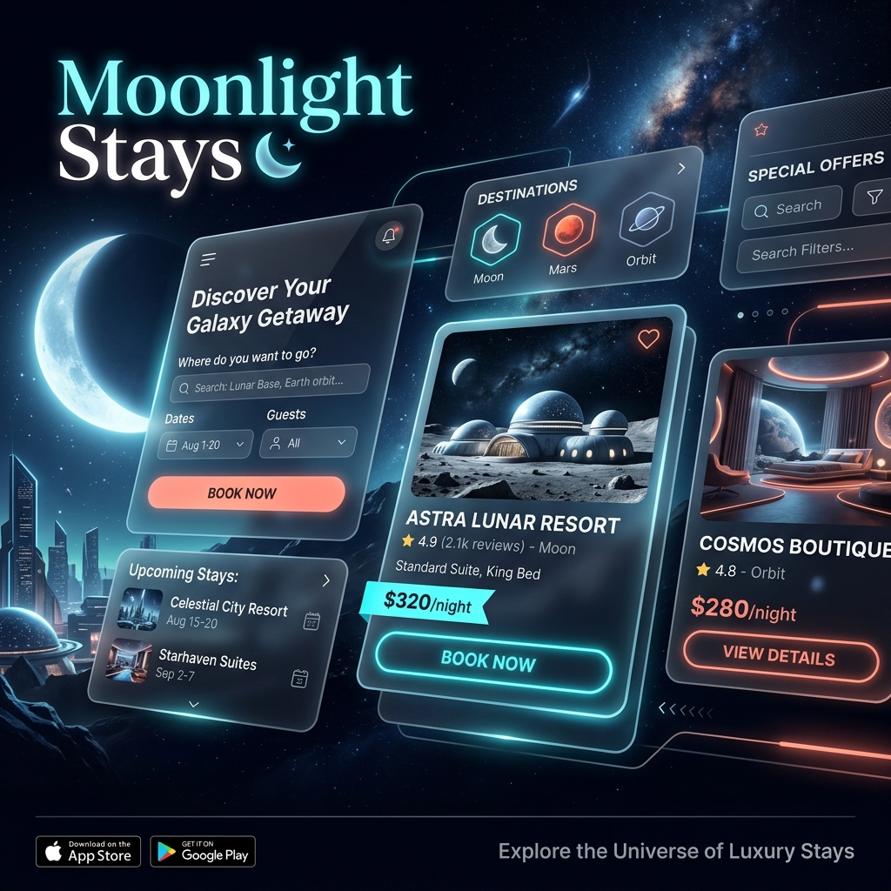
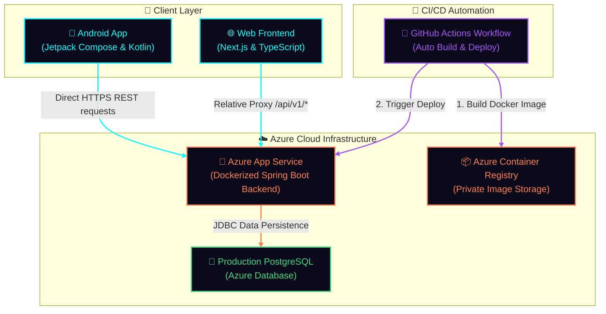
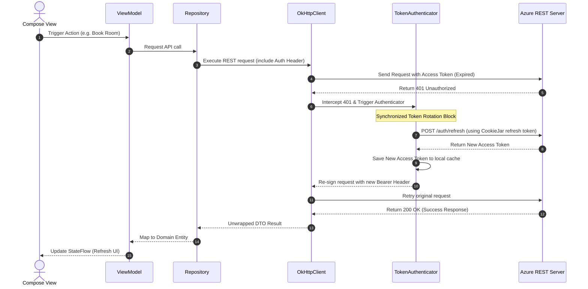

<div align="center">

# 🌙 Moonlight Stays

### Airbnb-style Hotel Booking Platform




[](https://spring.io/projects/spring-boot)
[](https://nextjs.org/)
[](https://www.typescriptlang.org/)
[](https://www.postgresql.org/)
[](https://azure.microsoft.com/)
[](https://stripe.com/)
[](https://developer.android.com/)

**Full-stack hotel booking application** with dynamic pricing, Stripe payments, role-based access, and production Azure deployment.

[API Docs](https://moonlight-stays-backend-d6hga6dtg6c3cya2.centralindia-01.azurewebsites.net/api/v1/swagger-ui.html) · [Report Bug](https://github.com/Snehil208001/MoonLight-Stays/issues) · [Request Feature](https://github.com/Snehil208001/MoonLight-Stays/issues)

</div>

---

## 📋 Table of Contents

- [About the Project](#-about-the-project)
- [Live Demo](#-live-demo)
- [Features](#-features)
- [Tech Stack](#-tech-stack)
- [Architecture & System Design](#-architecture--cloud-infrastructure)
- [Android Client Architecture](#-android-client-architecture)
- [Azure Cloud Infrastructure & CI/CD](#-azure-cloud-infrastructure--cicd-pipeline)
- [Project Structure](#-project-structure)
- [Getting Started](#-getting-started)
- [API Overview](#-api-overview)
- [Documentation](#-documentation)
- [License](#-license)

---

## 🎯 About the Project

**Moonlight Stays** is a production-ready, full-stack hotel booking platform inspired by Airbnb. Built from scratch with modern technologies, it demonstrates end-to-end ownership from UI design to database schema, payment integration, and cloud deployment.

### Key Highlights

| Aspect | Implementation |
|--------|----------------|
| **Android Client** | Kotlin, Jetpack Compose, Dagger Hilt, Retrofit/OkHttp, Session CookieJar & JWT Token Authenticator, custom Canvas animations |
| **Backend** | Java 17, Spring Boot 3.5, Spring Data JPA, Spring Security (JWT) |
| **Frontend** | Next.js 14 (App Router), React 18, TypeScript, Redux Toolkit, Tailwind CSS, Framer Motion |
| **Database** | PostgreSQL with complex relational models (hotels, rooms, bookings, reviews, promo codes) |
| **Payments** | Stripe Checkout with webhook verification |
| **Auth** | JWT with refresh tokens, role-based access (Guest / Hotel Manager) |
| **Design Patterns** | Strategy pattern for dynamic room pricing (surge, holiday, occupancy-based) |
| **DevOps** | Azure App Service (backend, Docker), Azure Container Registry, GitHub Actions CI/CD |


---

## 🚀 Live Demo

| Resource | URL |
|----------|-----|
| **Backend API** | [https://moonlight-stays-backend-d6hga6dtg6c3cya2.centralindia-01.azurewebsites.net/api/v1](https://moonlight-stays-backend-d6hga6dtg6c3cya2.centralindia-01.azurewebsites.net/api/v1) |
| **API Docs (Swagger)** | [https://moonlight-stays-backend-d6hga6dtg6c3cya2.centralindia-01.azurewebsites.net/api/v1/swagger-ui.html](https://moonlight-stays-backend-d6hga6dtg6c3cya2.centralindia-01.azurewebsites.net/api/v1/swagger-ui.html) |

---

## ✨ Features

### For Guests 👤

| Feature | Description |
|---------|-------------|
| **Search Hotels** | Filter by city, check-in/out dates, rooms, guests, price range, amenities |
| **Hotel Details** | Photos, amenities, room types, dynamic pricing based on dates |
| **Bookings** | Multi-step flow with guest details, promo codes, and Stripe checkout |
| **Reviews & Ratings** | Add and view hotel reviews with star ratings |
| **Favorites** | Save hotels for later with persistent storage |
| **My Bookings** | View, filter, and cancel bookings with status tracking |

### For Hotel Managers 🏨

| Feature | Description |
|---------|-------------|
| **Admin Dashboard** | Manage hotels, rooms, and promo codes from a dedicated interface |
| **CRUD Operations** | Create, update, delete hotels and rooms with validation |
| **Surge Pricing** | Set dynamic pricing for date ranges (holidays, events) |
| **Image Uploads** | Add hotel and room photos with preview |
| **Promo Codes** | Create discount codes with percentage or fixed amount |

### Technical Features ⚙️

- **Strategy Design Pattern** — Handles complex, dynamic room pricing (surge, holiday, occupancy-based)
- **JWT Authentication** — Secure auth with refresh token rotation
- **Stripe Webhooks** — Server-side payment confirmation
- **CORS & Proxy** — Next.js rewrites proxy API calls to avoid mixed-content issues
- **Responsive UI** — Dark-mode glassmorphism design with Framer Motion animations

---

## 🛠 Tech Stack

### Backend

| Technology | Purpose |
|------------|---------|
| **Java 17** | Core language |
| **Spring Boot 3.5** | REST API framework |
| **Spring Data JPA** | Database access, repositories |
| **Spring Security** | JWT auth, role-based access |
| **PostgreSQL** | Relational database |
| **Stripe Java SDK** | Payment processing |
| **SpringDoc OpenAPI** | Swagger/OpenAPI documentation |

### Frontend

| Technology | Purpose |
|------------|---------|
| **Next.js 14** | React framework, App Router |
| **TypeScript** | Type safety |
| **Redux Toolkit** | State management |
| **Tailwind CSS** | Styling |
| **Framer Motion** | Animations |
| **Lucide React** | Icons |

### Android App Client

| Technology | Purpose |
|------------|---------|
| **Kotlin** | Programming language |
| **Jetpack Compose** | Declarative UI framework |
| **Hilt (Dagger)** | Dependency Injection |
| **Retrofit / OkHttp** | Network HTTP client |
| **State-Hoisted ViewModels** | Clean reactive MVI/MVVM design |

### DevOps & Deployment

| Service | Purpose |
|---------|---------|
| **Azure App Service** | Backend hosting (Docker container) |
| **Azure Container Registry** | Stores backend Docker images |
| **GitHub Actions** | CI/CD — builds and deploys on push |
| **PostgreSQL** | Production database |
| **Stripe** | Payment processing |

---

## 🏗 Architecture & Cloud Infrastructure

### System Design Map
The Moonlight Stays platform leverages a modern, containerized backend and decoupled web and mobile clients connected through clean REST interfaces.



### Request Flow
1. **User Client Access**: A web browser requests Next.js frontend pages (rendered server-side/static) or an Android user launches the Kotlin application.
2. **REST API Routing**:
   - **Web Client**: Calls relative path `/api/v1/*`. Next.js proxies these calls to avoid CORS issues.
   - **Android Client**: Talks directly to the Azure backend base URL via Retrofit with cookie/token interceptors.
3. **Stateless Authentication**: The backend verifies incoming JWT access tokens. If expired, the Android client's `TokenAuthenticator` requests a token refresh transparently.
4. **Database Operations**: The backend processes the request, computes dynamic strategy-based pricing, and queries PostgreSQL.
5. **Third-Party Webhooks**: Stripe sends payment notifications to the webhook listener to verify and confirm booking reservations.

---

## 📱 Android Client Architecture & Engineering Deep-Dive

The mobile client is a production-grade, offline-ready native Android application written in **Kotlin** and built 100% on **Jetpack Compose**. It implements **Clean Architecture** principles by segregating concerns into distinct layers: UI (presentation), Domain (business logic), and Data (remote APIs and mapping).

---

### 🏛 Architectural Layering

#### 1. Domain Layer (Pure Business Logic)
The domain layer defines the core contract of the application. It contains **Entities**, **Repository Interfaces**, and **Use Cases (Interactors)**. By keeping it free of Android framework dependencies, it remains highly testable and robust.
- **Use Cases:** Every business action is encapsulated in a single, reusable class. For example:
  - [GetActivePromoCodesUseCase](file:///C:/Users/snehi/OneDrive/Desktop/AirBnb_BackEnd/app/src/main/java/com/snehil/moon_stays_androidapp/domain/usecase/GetActivePromoCodesUseCase.kt) — Retrieves and filters valid promotions.
  - [ValidatePromoCodeUseCase](file:///C:/Users/snehi/OneDrive/Desktop/AirBnb_BackEnd/app/src/main/java/com/snehil/moon_stays_androidapp/domain/usecase/ValidatePromoCodeUseCase.kt) — Performs client-side validation logic.
  - [UploadImageUseCase](file:///C:/Users/snehi/OneDrive/Desktop/AirBnb_BackEnd/app/src/main/java/com/snehil/moon_stays_androidapp/domain/usecase/UploadImageUseCase.kt) — Encapsulates image packaging and multipart requests.
- **Repository Contracts:** Domain interfaces like [HotelRepository](file:///C:/Users/snehi/OneDrive/Desktop/AirBnb_BackEnd/app/src/main/java/com/snehil/moon_stays_androidapp/domain/repository/HotelRepository.kt) isolate business logic from remote network implementation.

#### 2. Presentation Layer (Reactive Declarative UI)
Built entirely using Jetpack Compose, state is managed in a unidirectional data flow (UDF):
- **State Hoisting:** Compose screens are stateless composables that accept state parameters and propagate events upward to ViewModels.
- **StateFlow & UI States:** ViewModels like [HotelDetailViewModel](file:///C:/Users/snehi/OneDrive/Desktop/AirBnb_BackEnd/app/src/main/java/com/snehil/moon_stays_androidapp/mainui/hoteldetail/viewmodel/HotelDetailViewModel.kt) expose screen state reactively via Kotlin `StateFlow`.
- **Cyberpunk / Midnight Glassmorphism Theme:** All UI tokens (from `tokens.json`) are translated into Kotlin color definitions, dimensions, shapes, and font typographies inside [ui/theme/](file:///C:/Users/snehi/OneDrive/Desktop/AirBnb_BackEnd/app/src/main/java/com/snehil/moon_stays_androidapp/ui/theme/) to enforce visual parity.

#### 3. Data Layer (Decoupled APIs & Repositories)
Handles raw data access, networking, and DTO mapping.
- **API Services:** Declarative Retrofit interfaces mapped to REST routes:
  - [AuthApiService](file:///C:/Users/snehi/OneDrive/Desktop/AirBnb_BackEnd/app/src/main/java/com/snehil/moon_stays_androidapp/data/remote/AuthApiService.kt) — signup, login, refresh.
  - [HotelApiService](file:///C:/Users/snehi/OneDrive/Desktop/AirBnb_BackEnd/app/src/main/java/com/snehil/moon_stays_androidapp/data/remote/HotelApiService.kt) — browsing, ratings, reviews.
  - [AdminApiService](file:///C:/Users/snehi/OneDrive/Desktop/AirBnb_BackEnd/app/src/main/java/com/snehil/moon_stays_androidapp/data/remote/AdminApiService.kt) — hotel creations and updates.
- **Repository Implementations:** Classes like [HotelRepositoryImpl](file:///C:/Users/snehi/OneDrive/Desktop/AirBnb_BackEnd/app/src/main/java/com/snehil/moon_stays_androidapp/data/repository/HotelRepositoryImpl.kt) coordinate remote requests and map network DTOs (e.g. [HotelDtos](file:///C:/Users/snehi/OneDrive/Desktop/AirBnb_BackEnd/app/src/main/java/com/snehil/moon_stays_androidapp/data/remote/dto/HotelDtos.kt)) into clean Domain entities.

---

### 🔌 Advanced Network & Auth Flow (Recruiter Deep-Dive)

Handling authentication securely is one of the most critical aspects of production apps. This client handles JWT access and refresh tokens completely transparently at the OkHttp layer:



- **Session Tracking via [SessionCookieJar](file:///C:/Users/snehi/OneDrive/Desktop/AirBnb_BackEnd/app/src/main/java/com/snehil/moon_stays_androidapp/core/common/SessionCookieJar.kt):** Spring Boot returns a secure HTTP-Only `refreshToken` cookie on login. Since standard Retrofit calls don't persist cookies across app sessions, a custom `CookieJar` implementation stores and includes this cookie automatically in `/auth/refresh` requests.
- **Automatic Recovery via [TokenAuthenticator](file:///C:/Users/snehi/OneDrive/Desktop/AirBnb_BackEnd/app/src/main/java/com/snehil/moon_stays_androidapp/core/common/TokenAuthenticator.kt):** Standard requests include the current access token. If it expires and the server returns `401 Unauthorized`, the custom OkHttp `Authenticator` intercepts the response, launches a synchronized blocking request to refresh the token, saves the new token to memory/disk, re-signs the original request, and retries it automatically. The user experiences absolutely zero session interruption!

---

### 🎨 Premium UI Graphics & Fluid Animations

To achieve the "Midnight Glassmorphism" style, the UI relies on custom Compose canvas manipulation and micro-interactions:
- **Custom Glow Rings:** The app utilizes drawing scopes in Compose Canvas to draw rings with radial gradient brushes and drop shadows (`Paint.asFrameworkPaint().setShadowLayer`), creating realistic neon glow effects for active status buttons.
- **Glass Frosted Surfaces:** Semi-transparent backdrops (`Color.White.copy(alpha = 0.08f)`) are coupled with layered custom borders and subtle inner shadows to simulate depth without native system blur overhead.
- **Navigation Transitions:** Custom screen-slide animations defined inside Navigation graphs using `AnimatedVisibility` and slide transitions create fluid, organic transitions when switching between Hotel Details, Reviews, and Booking steps.
- **Interactive States:** Floating Action Buttons (FABs) scale and morph color dynamically based on scrolling velocity. Ripple propagation effects are color-tailored using custom ripple themes.

---

## ☁️ Azure Cloud Infrastructure & CI/CD Pipeline

The application is deployed on enterprise-grade Azure infrastructure with complete automation.

### Cloud Services Used
- **Azure App Service**: Hosts the Dockerized Spring Boot Java monolithic backend. Configured to scale and serve web requests securely over TLS/SSL.
- **Azure Container Registry (ACR)**: Private container registry containing all compiled backend Docker tags.
- **Azure Database for PostgreSQL**: Production database storing relation schemas (Hotels, Bookings, Users, Reviews, Promo Codes) with automated backups and connection encryption.

### Continuous Integration & Deployment (CI/CD)
The deployment is entirely automated via GitHub Actions:
1. **Developer Push**: A commit pushed to `main` triggers the Azure Deployment workflow.
2. **Multi-stage Docker Build**:
   - The runner pulls a Maven container, resolves dependencies, compiles the code, and builds a production JAR.
   - The JAR is copied to a slim, production-ready Eclipse Temurin JRE container.
3. **Registry Upload**: The runner builds the Docker tags (`latest` and `$SHA`) and pushes them to Azure Container Registry.
4. **App Service Rollout**: Azure App Service pulls the newly pushed image and performs a zero-downtime rolling update.

---


## 📁 Project Structure

```
MoonLight-Stays/
├── airBnbApp/                      # Spring Boot backend
│   ├── src/main/java/
│   │   └── com/moonlight/project/airBnbApp/
│   │       ├── config/             # Security, CORS, Stripe, OpenAPI
│   │       ├── controller/         # REST controllers
│   │       ├── entity/             # JPA entities
│   │       ├── repository/         # Spring Data repositories
│   │       ├── service/             # Business logic (Strategy pattern for pricing)
│   │       └── security/            # JWT, WebSecurityConfig
│   ├── src/main/resources/
│   │   ├── application.properties
│   │   └── application-prod.properties
│   └── pom.xml
│
├── moonlight-stays/                # Next.js frontend
│   ├── src/
│   │   ├── app/                    # Pages, layouts (App Router)
│   │   ├── components/             # React components
│   │   └── lib/                    # API client, utilities
│   ├── public/
│   └── package.json
│
├── app/                            # Android Jetpack Compose client
│   ├── src/main/java/
│   │   └── com/snehil/moon_stays_androidapp/
│   │       ├── core/               # Navigation routes, Hilt modules, utilities
│   │       ├── mainui/             # Glassmorphic UI Screens (Login, SignUp, Onboarding, Guest/Manager Dashboards, Details, Reviews)
│   │       └── ui/theme/           # Cyberpunk color tokens & Compose shapes
│   └── build.gradle.kts            # Application Gradle configurations
│
├── .github/workflows/
│   └── azure-deploy.yml            # CI/CD — Docker build, push to ACR, deploy to App Service
├── Dockerfile                      # Backend container image
└── README.md
```

---

## 🚀 Getting Started

### Prerequisites

- **Node.js** 18+ and npm
- **Java** 17 and Maven
- **PostgreSQL** (or H2 for dev)
- **Stripe CLI** (optional, for local webhook testing)

### Quick Start

```bash
# Clone the repository
git clone https://github.com/Snehil208001/MoonLight-Stays.git
cd MoonLight-Stays

# Install dependencies and run everything
npm install
npm run dev
```

This starts:
- **Backend** — `http://localhost:8080`
- **Frontend** — `http://localhost:3000`
- **Stripe webhook listener** — For local payment testing

### Run Individually

```bash
# Backend only
cd airBnbApp && mvn spring-boot:run

# Frontend only
cd moonlight-stays && npm run dev

# Stripe webhooks (for payments)
stripe listen --forward-to localhost:8080/api/v1/webhooks/payment

# Android App (local debug apk compile)
.\gradlew assembleDebug
```

### Environment Variables

Create `moonlight-stays/.env.local`:

```env
NEXT_PUBLIC_API_URL=http://localhost:8080/api/v1
```

---

## ☁️ Deployment

### Azure Services

| Service | Purpose |
|---------|---------|
| **Azure App Service** | Runs the Dockerized Spring Boot backend over HTTPS |
| **Azure Container Registry** | Stores the backend Docker images (`moonlightstaysacr`) |
| **GitHub Actions** | Builds and deploys automatically on every push |

### Deploy Backend (Azure App Service)

Push to `main` — the [azure-deploy.yml](./.github/workflows/azure-deploy.yml) workflow builds the Docker image from the root `Dockerfile`, pushes it to Azure Container Registry, and deploys it to the `moonlight-stays-backend` App Service.

### Region & URLs

- **Region**: Central India
- **Backend**: https://moonlight-stays-backend-d6hga6dtg6c3cya2.centralindia-01.azurewebsites.net

---

## 📡 API Overview

| Area | Endpoints |
|------|-----------|
| **Auth** | `POST /auth/signup`, `POST /auth/login`, `POST /auth/refresh` |
| **Hotels** | `POST /hotels/search`, `GET /hotels/{id}/info` |
| **Bookings** | `POST /bookings/init`, `POST /bookings/{id}/payments` |
| **Admin** | `POST /admin/hotels`, `GET /admin/hotels`, `PATCH /admin/hotels/{id}/surge` |

### 📖 Swagger API Documentation

The backend REST API is fully documented using **Springdoc OpenAPI / Swagger UI**. This provides an interactive sandbox to explore, test, and run the API endpoints.

| Environment | Swagger UI Endpoint | OpenAPI Specification (JSON) |
|-------------|---------------------|-----------------------------|
| **Local Development** | [http://localhost:8080/api/v1/swagger-ui.html](http://localhost:8080/api/v1/swagger-ui.html) | [http://localhost:8080/api/v1/v3/api-docs](http://localhost:8080/api/v1/v3/api-docs) |
| **Production Azure** | [https://moonlight-stays-backend-d6hga6dtg6c3cya2.centralindia-01.azurewebsites.net/api/v1/swagger-ui.html](https://moonlight-stays-backend-d6hga6dtg6c3cya2.centralindia-01.azurewebsites.net/api/v1/swagger-ui.html) | [https://moonlight-stays-backend-d6hga6dtg6c3cya2.centralindia-01.azurewebsites.net/api/v1/v3/api-docs](https://moonlight-stays-backend-d6hga6dtg6c3cya2.centralindia-01.azurewebsites.net/api/v1/v3/api-docs) |

#### Testing Secured Endpoints (JWT Bearer Token)
Many endpoints require authentication (such as booking management, user profiles, or administrator views). To run these endpoints directly from Swagger:
1. Obtain an access token by executing the `/auth/login` endpoint with your credentials.
2. Copy the `accessToken` value from the response.
3. Click the green **Authorize** button at the top right of the Swagger UI page.
4. Enter the token in the following format: `Bearer <your_copied_token>` (make sure to include the `Bearer ` prefix with a space).
5. Click **Authorize** and close the modal. All subsequent requests from the Swagger UI will automatically include the authentication header.


---

## 📚 Documentation

| Document | Description |
|----------|-------------|
| [DEV_SETUP.md](./DEV_SETUP.md) | Local development setup |
| [ROLE_BASED_FUNCTIONALITY.md](./ROLE_BASED_FUNCTIONALITY.md) | API endpoints by user role |
| [API_INTEGRATION_PLAN.md](./API_INTEGRATION_PLAN.md) | API integration details |

---

## 🌟 Highlights for Android & Full-Stack Recruiters

This repository showcases production-grade mobile engineering and full-stack ownership. If you are an Android technical recruiter or engineering manager, here are the key highlights to look for in the code:

### 🤖 Core Android Engineering Excellence
- **Clean Architecture & Domain Separation:** Logic is fully isolated into clean abstractions. Check out the [domain Use Cases](file:///C:/Users/snehi/OneDrive/Desktop/AirBnb_BackEnd/app/src/main/java/com/snehil/moon_stays_androidapp/domain/usecase/) (e.g. [ValidatePromoCodeUseCase](file:///C:/Users/snehi/OneDrive/Desktop/AirBnb_BackEnd/app/src/main/java/com/snehil/moon_stays_androidapp/domain/usecase/ValidatePromoCodeUseCase.kt)) which encapsulate business rules separate from data sources or UI.
- **Modern Jetpack Compose UI:** The entire interface is built with declarative Jetpack Compose using state hoisting, unidirectional data flow (UDF), and state-hoisted ViewModels. See [HotelDetailViewModel](file:///C:/Users/snehi/OneDrive/Desktop/AirBnb_BackEnd/app/src/main/java/com/snehil/moon_stays_androidapp/mainui/hoteldetail/viewmodel/HotelDetailViewModel.kt).
- **Advanced OkHttp & Session Recovery:**
  - **Auto-Refreshing JWT Auth:** The [TokenAuthenticator](file:///C:/Users/snehi/OneDrive/Desktop/AirBnb_BackEnd/app/src/main/java/com/snehil/moon_stays_androidapp/core/common/TokenAuthenticator.kt) handles thread-safe Token Rotation. When a 401 occurs, it halts requests, requests a refresh token, updates cache, and retries the failed requests.
  - **Session Cookie management:** The [SessionCookieJar](file:///C:/Users/snehi/OneDrive/Desktop/AirBnb_BackEnd/app/src/main/java/com/snehil/moon_stays_androidapp/core/common/SessionCookieJar.kt) handles preserving secure `HttpOnly` refresh token cookies across sessions.
- **Dependency Injection (Dagger Hilt):** Modules are cleanly decoupled for networking, data repositories, and use cases. See [NetworkModule](file:///C:/Users/snehi/OneDrive/Desktop/AirBnb_BackEnd/app/src/main/java/com/snehil/moon_stays_androidapp/core/di/NetworkModule.kt).
- **Premium UX Animations & UI Polish:** Check out the cyberpunk/midnight theme in [ui/theme/](file:///C:/Users/snehi/OneDrive/Desktop/AirBnb_BackEnd/app/src/main/java/com/snehil/moon_stays_androidapp/ui/theme/) and interactive Compose canvas renderings.

### 🔌 Full-Stack & System Integration
- **Zero-Downtime Azure Deployment:** Deployed via Docker container on Azure App Service and private ACR with automated CI/CD GitHub Actions.
- **Spring Boot 3.5 Monolithic Backend:** Secure JWT configurations, transactional JPA storage, and a decorator-chained **Strategy Pattern** for dynamic surge and occupancy pricing.
- **Swagger Interactive API:** Fully documented REST endpoints accessible locally and in production via Swagger OpenAPI.

---

## 📄 License

Private project — All rights reserved.

---

<div align="center">

**Built with ❤️ by [Snehil](https://github.com/Snehil208001)**

[⬆ Back to Top](#-moonlight-stays)

</div>
