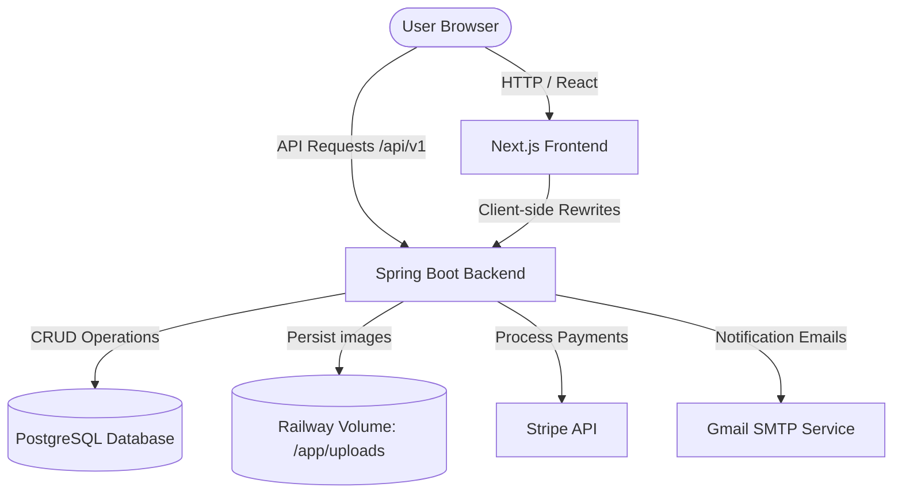
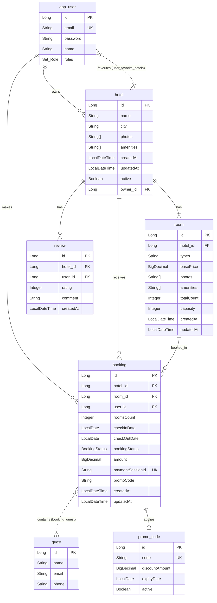
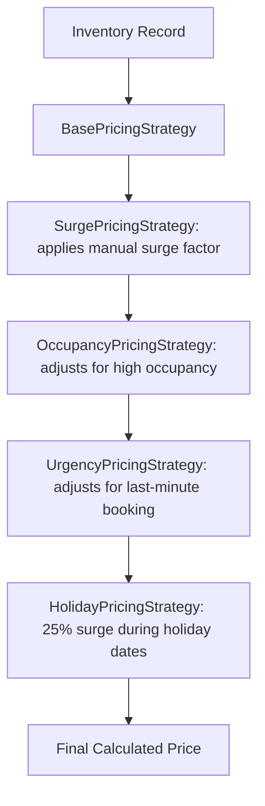
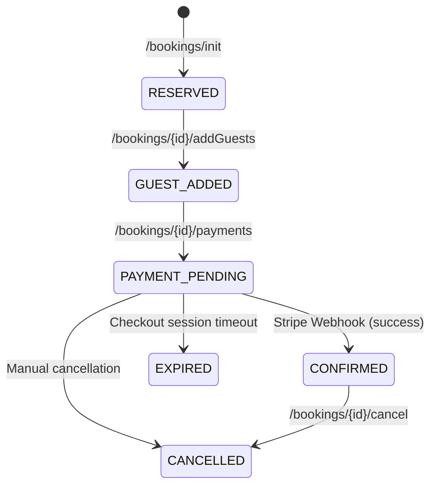

# MoonLight Stays System Design

This document details the architectural, database, and system design of **MoonLight Stays**, a full-stack, real-time hotel listing and booking platform.

---

## 1. System Architecture

MoonLight Stays is built as a decoupled Client-Server architecture:

---

## 2. Database Schema

The persistent layer is backed by **PostgreSQL** containing the following entity relationships:

---

## 3. Technology Stack

### Frontend (`moonlight-stays`)
- **Framework**: Next.js 14 (App Router, Standalone Output)
- **Language**: TypeScript
- **Styling**: Tailwind CSS, PostCSS
- **State Management & Data Fetching**: React Hooks, Fetch API with middleware API rewrites proxy

### Backend (`airBnbApp`)
- **Framework**: Spring Boot 3.5 (Java 17)
- **Database**: PostgreSQL (Production) / H2 (Testing)
- **ORM / Persistence**: Spring Data JPA, Hibernate
- **Security**: Spring Security 6 (JWT stateless authentication)
- **APIs & Tooling**: Springdoc OpenAPI v3 (Swagger UI), Spring Actuator (Health & Metrics)

---

## 4. Key Workflows & System Designs

### 1. Dynamic Pricing Engine (Decorator Pattern)
The application implements a flexible **Decorator Pattern** on top of a base pricing strategy to calculate dynamic room prices in real-time.

- **BasePricingStrategy**: Pulls raw room base price.
- **SurgePricingStrategy**: Multiplies price by manual `surgeFactor` set on the inventory date by managers.
- **OccupancyPricingStrategy**: Increases price when remaining inventory drops below critical thresholds.
- **UrgencyPricingStrategy**: Increases price if search/booking is requested within 1–2 days of check-in.
- **HolidayPricingStrategy**: Multiplies by `1.25` for high-season calendar dates.

### 2. Room Inventory & Search Flow
Room availability and dynamic pricing are tracked on a per-day, per-room basis via the `Inventory` table:
- **Search Query**: A user searches for a `city`, `checkInDate`, `endDate`, and `roomsCount`.
- **Validation**: The backend checks the `Inventory` table for the specified date range. A hotel is returned only if **every single night** in the requested range has at least `roomsCount` rooms available.
- **Pricing Calculation**: The total price shown to the user is the sum of calculated dynamic prices for each night in the range.

### 3. Stripe Payments Webhook & Booking States
The booking workflow follows a strict state transition to manage room reserves:

- **Stripe Webhook Listener**: Handled by `WebhookController` which listens to `checkout.session.completed`. Upon receipt of a valid signature and session ID matching a booking, the status is updated to `CONFIRMED`.

### 4. File Uploads & Persistent Storage
- Listing images are uploaded via `/upload` by managers.
- Saved locally under `uploads/` directory inside the project root.
- Served publicly via resource handler mapping `file:uploads/` to `/images/**`.
- In production (Railway), this maps to a **Persistent Volume** mounted at `/app/uploads` to prevent image loss on container redeployments.

### 5. Wishlists / Favorites System
- Authenticated users can favorite hotels.
- Designed as a `@ManyToMany` relationship mapped through `user_favorite_hotels` join table.
- Excluded from standard user serialization using `@JsonIgnore` to avoid `LazyInitializationException` and recursion.

---

## 5. Role-Based Authorization Matrix

### Available Roles
1. **GUEST**: Regular customers who browse, book, and manage stays.
2. **HOTEL_MANAGER**: Listings owner who manages hotels, room inventories, and pricing.

### API Authorization Table

| Endpoint | Method | Allowed Roles | Description |
|---|---|---|---|
| `/api/v1/auth/signup` | POST | Public | Create new Guest account |
| `/api/v1/auth/admin/signup` | POST | Public | Create new Hotel Manager account |
| `/api/v1/auth/login` | POST | Public | Authenticate user and issue JWT |
| `/api/v1/hotels/search` | POST | Public | Search available hotels |
| `/api/v1/hotels/{hotelId}/info` | GET | Public | Fetch hotel and room details |
| `/api/v1/bookings/init` | POST | GUEST, HOTEL_MANAGER | Initialize booking (RESERVED status) |
| `/api/v1/bookings/{id}/addGuests` | POST | GUEST, HOTEL_MANAGER | Add guest details to booking |
| `/api/v1/bookings/{id}/payments` | POST | GUEST, HOTEL_MANAGER | Initiate Stripe checkout session |
| `/api/v1/hotels/{id}/reviews` | POST | GUEST, HOTEL_MANAGER | Write a review (requires booking) |
| `/api/v1/users/favorites` | GET/POST/DELETE | GUEST, HOTEL_MANAGER | Manage user wishlists |
| `/api/v1/admin/hotels/**` | ALL | HOTEL_MANAGER | Add, edit, delete, or activate hotels |
| `/api/v1/admin/hotels/{id}/surge` | PATCH | HOTEL_MANAGER | Update surge factor for date range |
| `/api/v1/admin/hotels/{id}/rooms/**` | ALL | HOTEL_MANAGER | Add, delete, and view room definitions |
| `/api/v1/admin/promocodes` | POST | HOTEL_MANAGER | Define discount codes |
| `/api/v1/webhooks/payment` | POST | Public | Stripe server-to-server webhook |
