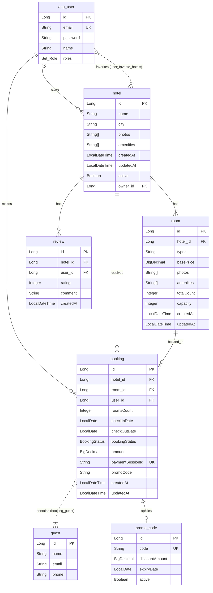

# MoonLight Stays System Design

This document details the architectural, database, and system design of **MoonLight Stays**, a full-stack, real-time hotel listing and booking platform.

---

## 1. System Architecture

MoonLight Stays is built as a decoupled Client-Server architecture:

---

## 2. Database Schema

The persistent layer is backed by **PostgreSQL** containing the following entity relationships:

---

## 3. Technology Stack

### Frontend (`moonlight-stays`)
- **Framework**: Next.js 14 (App Router)
- **Language**: TypeScript
- **Styling**: Tailwind CSS
- **State Management / Data Fetching**: React Hooks, Fetch API

### Backend (`airBnbApp`)
- **Framework**: Spring Boot 3.5 (Java 17)
- **Database**: PostgreSQL (Production) / H2 (Testing)
- **ORM / Persistence**: Spring Data JPA, Hibernate
- **Security**: Spring Security 6 (JWT stateless authentication)
- **APIs & Tooling**: Springdoc OpenAPI v3 (Swagger UI), Spring Actuator (Health & Metrics)

---

## 4. Key Workflows & API Flow Design

### 1. Authentication Flow
- User registers via `/auth/signup` and logins via `/auth/login`.
- JWT token is issued by the backend and stored in the browser (local storage or cookies).
- Every authenticated request carries the token in the `Authorization: Bearer <token>` header.

### 2. Search & Booking Flow
- Guest performs availability search via `/hotels/search`.
- Backend filters hotels and calculates minimum prices based on rooms/inventory using JPA queries.
- Guest selects hotel & room, then initiates booking via `/bookings`.
- Stripe Session is created (`paymentSessionId` stored in `booking` table) and returns checkout URL.
- Upon successful checkout, Stripe webhook triggers payment confirmation to update booking status.

### 3. File Uploads
- Admin uploads listing images via `/upload`.
- Backend saves files to `/app/uploads` (mapped to persistent storage in deployment) and exposes them through static mapping `/images/**`.
