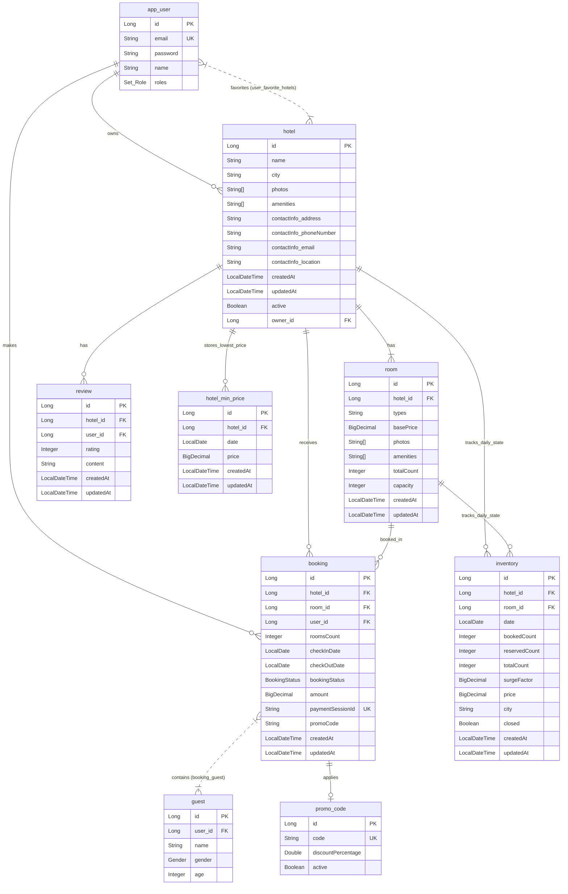
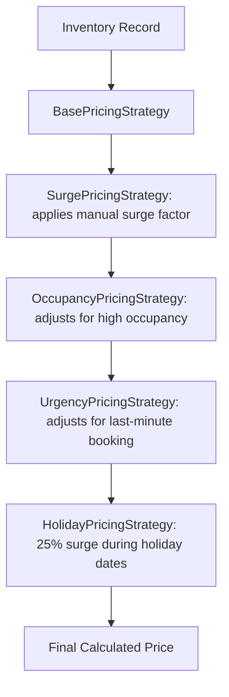
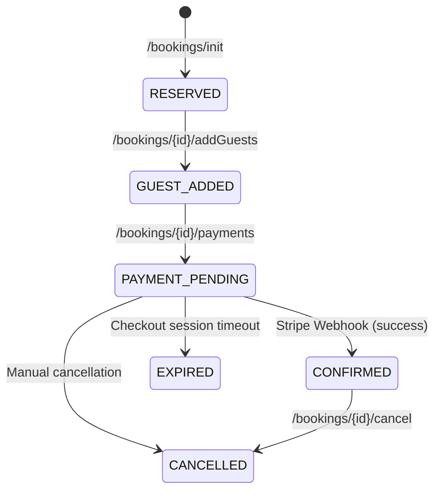

# MoonLight Stays System Design

This document details the architectural, database, frontend, backend, and security design of **MoonLight Stays**, a full-stack, real-time hotel listing and booking platform.

---

## 1. System Architecture

MoonLight Stays is built as a decoupled Client-Server architecture:

---

## 2. Database Schema

The persistent layer is backed by **PostgreSQL** (Production) / **H2** (Development/Testing) containing the following entity relationships:

---

## 3. Frontend Architecture (`moonlight-stays`)

The frontend is a single page application built on **Next.js 14** using the App Router.

### 1. Global State Management (Redux Toolkit)
- **Auth Slice (`authSlice.ts`)**: Tracks the authenticated user's state, user role (`GUEST` vs. `HOTEL_MANAGER`), details (email, name), JWT access tokens, and favorites.
- Syncs authentication states with client storage and refresh tokens for sessions.

### 2. Page Routing Map
- `/` - Landing Page with city search filters, listings, and calendar selects.
- `/login` - Unified login screen allowing role selection.
- `/profile` - Customer details & settings panel.
- `/favorites` - Wishlist displaying favorited hotels.
- `/hotels/[id]` - Booking details page showcasing hotel photos, reviews, and dynamic room lists.
- `/bookings` - User's booking history and active reservation manager.
- `/admin` - Portal for hosts to perform CRUD operations on listings, room capacities, and surge pricing.
- `/payments/success` & `/payments/failure` - Stripe callback targets.

---

## 4. Backend System Design & Key Workflows

### 1. Dynamic Pricing Engine (Decorator Pattern)
The application implements a flexible **Decorator Pattern** on top of a base pricing strategy to calculate dynamic room prices in real-time.

- **BasePricingStrategy**: Pulls raw room base price.
- **SurgePricingStrategy**: Multiplies price by manual `surgeFactor` set on the inventory date by managers.
- **OccupancyPricingStrategy**: Increases price when remaining inventory drops below critical thresholds.
- **UrgencyPricingStrategy**: Increases price if search/booking is requested within 1–2 days of check-in.
- **HolidayPricingStrategy**: Multiplies by `1.25` for high-season calendar dates.

### 2. Room Inventory & Search Flow
Room availability and dynamic pricing are tracked on a per-day, per-room basis via the `Inventory` table:
- **Search Query**: A user searches for a `city`, `checkInDate`, `endDate`, and `roomsCount`.
- **Validation**: The backend checks the `Inventory` table for the specified date range. A hotel is returned only if **every single night** in the requested range has at least `roomsCount` rooms available.
- **Pricing Calculation**: The total price shown to the user is the sum of calculated dynamic prices for each night in the range.

### 3. Stripe Payments Webhook & Booking States
The booking workflow follows a strict state transition to manage room reserves:

- **Stripe Session Creation**: Initiated via `/bookings/{bookingId}/payments`. Creates a Stripe Customer, sets mode to `PAYMENT`, requires billing addresses, converts amounts to paise/cents (INR), and sets up success and cancellation callback URLs pointing to the frontend.
- **Stripe Webhook Listener**: Handled by `WebhookController` which listens to `checkout.session.completed`. Upon receipt of a valid signature and session ID matching a booking, the status is updated to `CONFIRMED`.
- **Refund Processing**: If a booking is cancelled (`/bookings/{bookingId}/cancel`), the backend fetches the `paymentIntent` from Stripe using the session ID, and issues a refund (`Refund.create`) automatically.

### 4. Promo Code & Discount Application
- Public endpoints list active promo codes and validate them.
- Discounts are validated based on validity status, code sanitization (removing quotes/whitespace), expiry, and case-insensitivity.
- Applied discount percentages directly lower the total Stripe checkout amount.

### 5. File Uploads & Persistent Storage
- Listing images are uploaded via `/upload` by managers.
- Saved locally under `uploads/` directory inside the project root.
- Served publicly via resource handler mapping `file:uploads/` to `/images/**`.
- In production (Railway), this maps to a **Persistent Volume** mounted at `/app/uploads` to prevent image loss on container redeployments.

---

## 5. Security & OpenAPI Details

### 1. JWT Authentication
- Custom JWT filter `JWTAuthFilter` runs on every incoming request.
- Decodes the `Authorization: Bearer <token>` header, validates the signature using `JWT_SECRET_KEY`, and populates the Spring Security Context with user details and roles.

### 2. Swagger OpenAPI Integration
- Fully integrated using `springdoc-openapi`.
- Accessible publicly at `/api/v1/swagger-ui/index.html` for API testing, documentation, and client generation.

---

## 6. Role-Based Authorization Matrix

### Available Roles
1. **GUEST**: Regular customers who browse, book, and manage stays.
2. **HOTEL_MANAGER**: Listings owner who manages hotels, room inventories, and pricing.

### API Authorization Table

| Endpoint | Method | Allowed Roles | Description |
|---|---|---|---|
| `/api/v1/auth/signup` | POST | Public | Create new Guest account |
| `/api/v1/auth/admin/signup` | POST | Public | Create new Hotel Manager account |
| `/api/v1/auth/login` | POST | Public | Authenticate user and issue JWT |
| `/api/v1/hotels/search` | POST | Public | Search available hotels |
| `/api/v1/hotels/{hotelId}/info` | GET | Public | Fetch hotel and room details |
| `/api/v1/bookings/init` | POST | GUEST, HOTEL_MANAGER | Initialize booking (RESERVED status) |
| `/api/v1/bookings/{id}/addGuests` | POST | GUEST, HOTEL_MANAGER | Add guest details to booking |
| `/api/v1/bookings/{id}/payments` | POST | GUEST, HOTEL_MANAGER | Initiate Stripe checkout session |
| `/api/v1/hotels/{id}/reviews` | POST | GUEST, HOTEL_MANAGER | Write a review (requires booking) |
| `/api/v1/users/favorites` | GET/POST/DELETE | GUEST, HOTEL_MANAGER | Manage user wishlists |
| `/api/v1/admin/hotels/**` | ALL | HOTEL_MANAGER | Add, edit, delete, or activate hotels |
| `/api/v1/admin/hotels/{id}/surge` | PATCH | HOTEL_MANAGER | Update surge factor for date range |
| `/api/v1/admin/hotels/{id}/rooms/**` | ALL | HOTEL_MANAGER | Add, delete, and view room definitions |
| `/api/v1/admin/promocodes` | POST | HOTEL_MANAGER | Define discount codes |
| `/api/v1/webhooks/payment` | POST | Public | Stripe server-to-server webhook |
